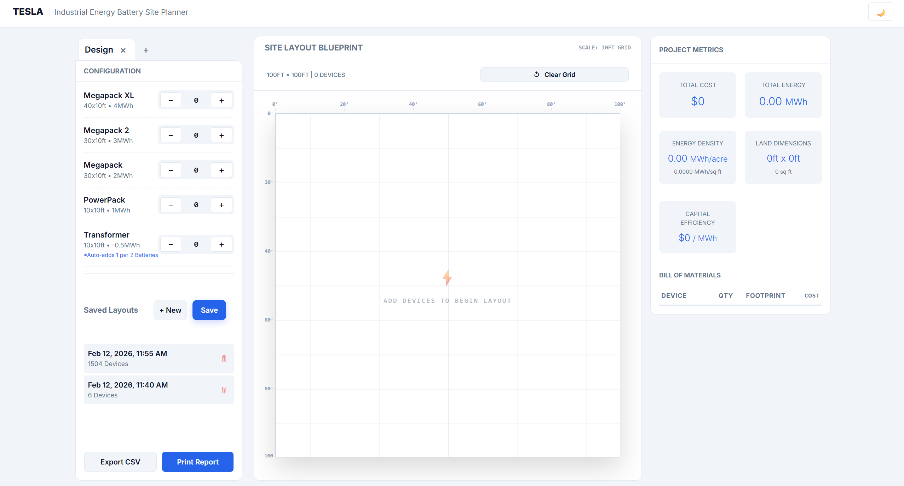
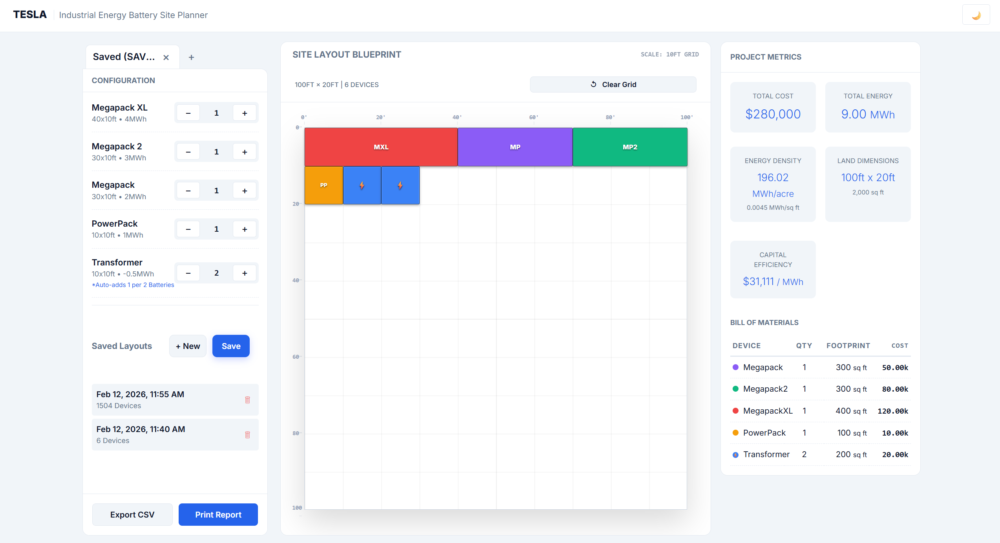

# Industrial Energy Site Layout Planner

A full-stack tool to design, validate, and visualize industrial battery sites. Built with **React + TypeScript** and a **Go** backend.

## ⚡ Features
- **Smart Configuration:** Add/remove Megapacks and PowerPacks with real-time validation.
- **Auto-Constraint Enforcement:** Automatically ensures **1 Transformer per 2 Batteries**.
- **Blueprint Visualization:** Interactive, grid-aligned site map that adheres to a **100ft max width**.
- **Tabbed Workspace:** Manage multiple site designs simultaneously in a single session.
- **Local Persistence:**  Designs are automatically saved to your browser (survives refreshes).
- **Server-Side Saving:** Persist completed designs to the backend (`JSON` storage).
- **Load/Edit:** Retrieve past designs via unique Session IDs.
- **Real-time Analytics:** Calculates Cost, Energy (MWh), Footprint (sq ft), and Energy Density (MWh/acre).
- **Theme-Aware Rendering:** Toggles between a "Dark Mode" (Night/CAD view) and "Light Mode" (Day/Schematic view).
- **Export Tools:** CSV Export and Print-ready reports.


## 🛠️ Tech Stack

### Frontend
- **Framework:** React + TypeScript (Vite)
- **Styling:** CSS Modules with CSS Variables
- **State Management:** Custom Hooks + LocalStorage + React Context patterns

### Backend
- **Language:** Go (Golang)
- **Architecture:** RESTful API with distinct Service/Handler layers
- **Persistence:** File-based JSON store (Simulates a NoSQL database)
- **Algorithm:** Custom 2D packing algorithm (Grid-based placement)

### DevOps
- **Containerization:** Docker & Docker Compose


## 🚀 Quick Start

## Option 1: Docker (Recommended)
- Run the entire stack (Frontend + Backend + Database) with one command:

```bash
docker compose up --build
```

```text
Frontend: http://localhost:8000

Backend: http://localhost:8080
```

Option 2: Manual Setup

Backend (Go)

```bash
cd server
go mod tidy
go run .
```

Frontend (React)

```bash
cd client
npm install
npm run dev
```

Live Example: `https://industrial-battery-site-planner.vercel.app/`


## 📂 Project Structure

```text
├── client/
│   ├── src/
│   │   ├── utils/
│   │   │   ├── dateUtils.ts            # Format to local time
│   │   ├── components/
│   │   │   ├── ConfigPanel.tsx         # Main sidebar controller
│   │   │   ├── LayoutPreview.tsx       # The Visual Blueprint (Grid)
│   │   │   ├── StatsPanel.tsx          # KPI Dashboard (Energy, Land Area, Cost)
│   │   │   ├── NavBar.tsx        	    # Navigation Bar
│   │   │   ├── TabBar.tsx        	    # Tab handling (adding, closing)
│   │   │   ├── SaveModal.tsx        	# Handles Saving work (create new design, save current design)
│   │   │   ├── SessionManager.tsx      # Save/Load/New Design UI
│   │   │   └── DeviceInputRow.tsx      # Individual counter component
│   │   ├── hooks/
│   │   │   └── useSiteLayout.ts        # Core Logic: State, API calls, Validation
│   │   └── types.ts                  	# Shared Type Definitions (DTOs)
│   └── App.css                       	# Global Variables (Themes, Colors)
│
├── server/
│   ├── main.go                       	# Entry point & CORS setup
│   ├── handlers.go               	    # HTTP Request Parsers
│   ├── service.go                	    # Business Logic (Packing Algo)
│   └── store.go                 	    # JSON File Persistence
│   └── data/
│       └── sessions.json             	# Persistent Storage File
│
└── docker-compose.yml                	# Orchestration
```

## API Reference

- **Layout Calculation**
`POST /api/calculate`

Body: { "configs": { "MegapackXL": 5, ... } }

Response: Returns coordinate list (x, y) for every device and total site dimensions.


 **Session Management**
- **Get Sessions**
`GET /api/sessions`

Response: List of all saved layouts with metadata (Date, Summary).

- **Save Session**
`POST /api/save`

Body: { "id": "optional-uuid", "configs": { ... } }

Response: Returns the saved Session ID.

- **Load Session**
`GET /api/load?id={id}`

Response: The configuration object for that specific ID.

- **Delete Session**
`DELETE /api/delete?id={id}`

Response: 200 OK.

## Running Tests
- This project includes unit tests for critical UI components (ConfigPanel) and logic.
- Frontend
```bash
cd client
npm test
```

- Backend
```bash
cd server
go test -v
```

## 📝 Design Notes
- Land dimensions are derived from the auto-generated layout bounding box (width <= 100 ft).
- Energy density is provided in MWh per sq ft and MWh per acre.
- Transformers: The system enforces a hard constraint of 1 Transformer for every 2 Batteries (rounded down).

## 📸 Screenshots

### MAIN UI



### Layout
